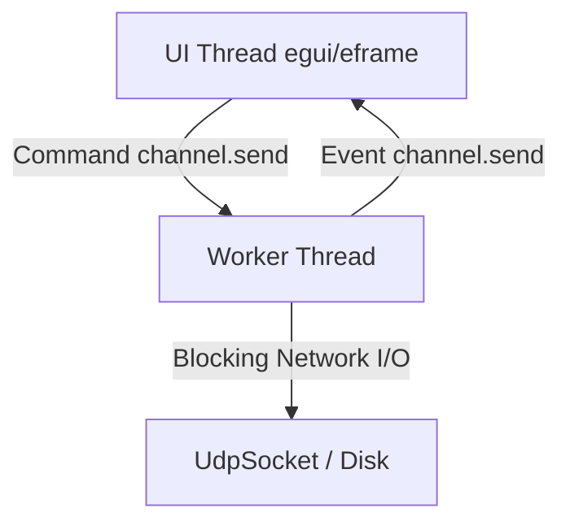

# Rust GUI Development Best Practices Guide (`AGENTS.md`)

This document outlines the architectural standards, code patterns, and development guidelines for building high-performance, robust, and clean GUI applications in Rust, specifically using `egui` and `eframe`.

---

## 🏗 1. Architectural Standards

Immediate-mode GUIs (like `egui`) run their rendering loop at up to 60+ FPS. Blocking the UI thread for even a few milliseconds will result in visual stutter or application freezes.

### 1.1 Separation of Concerns: UI Thread vs. Worker Threads
- **UI Thread**: Strictly handles event processing, rendering, style application, and transient input state (e.g. text buffers).
- **Worker Threads**: Handle all heavy computations, synchronous disk I/O, and networking operations (such as UDP/TCP socket binding, sending, and receiving).

### 1.2 Thread Communication via Channels
Do **NOT** share heavy mutable states directly between threads using `Arc<Mutex<T>>` if those states are accessed frequently in the UI loop, as lock contention will freeze the UI. 
Instead, use message-passing via standard channels:
- Send instructions to the worker thread via a `Sender<Command>`.
- Read updates on the UI thread via a non-blocking `Receiver<Event>` using `try_recv()` at the start of every frame.



---

## 🦀 2. Satisfying the Rust Borrow Checker in GUI State

Immediate-mode GUIs frequently nest closures (e.g., inside scroll areas, grids, panels). If your application state is monolithic, you will quickly encounter borrow-checker errors where a mutable borrow of `self` conflicts with another borrow of a subfield.

### 2.1 State Division (Wrapper Pattern)
If you are using layout-heavy components like `egui_dock::DockArea`, separate the layout state (`DockState`) from the application logic state. Wrap them in a master structure:

```rust
struct MainApp {
    dock_state: DockState<Tab>,
    state: UdpStudioState, // Application state is kept separately
}

impl eframe::App for MainApp {
    fn ui(&mut self, ui: &mut egui::Ui, _frame: &mut eframe::Frame) {
        // Structuring this way allows borrowing dock_state and state mutably at the same time
        let mut viewer = MyTabViewer { state: &mut self.state };
        DockArea::new(&mut self.dock_state).show_inside(ui, &mut viewer);
    }
}
```

### 2.2 Deferred Mutation Pattern
When iterating over collections (e.g., drawing list items) and selecting/modifying elements, do **NOT** attempt to mutate the parent structure directly inside the iteration loop. Instead, capture actions in local variables and apply the changes *after* the borrow scope ends:

```rust
// ❌ BAD: Borrows self mutably during self.saved_packets iteration
for packet in &self.saved_packets {
    if ui.button("🚀").clicked() {
        self.send_packet(&packet.target, packet.payload_type, &packet.payload); // Compile Error!
    }
}

//  GOOD: Collects actions and executes them outside the immutable borrow
let mut send_trigger = None;
for packet in &self.saved_packets {
    if ui.button("🚀").clicked() {
        send_trigger = Some((packet.target.clone(), packet.payload_type, packet.payload.clone()));
    }
}
if let Some((target, payload_type, payload)) = send_trigger {
    self.send_packet(&target, payload_type, &payload); // Compiles perfectly!
}
```

---

## ⚡ 3. Performance & Resource Optimization

Immediate-mode rendering redraws components frequently. To keep CPU/GPU utilization low, follow these guidelines:

### 3.1 Lazy Repaint Wakeups
By default, `eframe` runs in a reactive loop, repainting only on user events. When background threads receive data, they must explicitly wake the event loop:
- Call `ctx.request_repaint()` in the UI thread event loop immediately when receiving a message from background channels.
- Keep read timeouts in worker threads short (e.g., 100ms) to ensure responsive shutdowns, but avoid hot-looping.

### 3.2 Debounced Saving (I/O Limiting)
- Do **NOT** serialize state to disk on every single keypress inside `text_edit_singleline`.
- Instead, trigger saves when the field has `.changed()`, or write to disk only when focus is lost or key buttons are clicked.

---

## 🎨 4. egui Styling & Modern Design Tokens (egui 0.34+)

To create premium desktop designs, avoid using browser-default aesthetics. Customize your layout using `egui`'s unified styling.

### 4.1 Unified Panels
- Avoid using deprecated `TopBottomPanel` and `SidePanel` directly on the context (`ctx`).
- Instead, use the unified `egui::Panel` struct:
  - `egui::Panel::top("id")`
  - `egui::Panel::bottom("id")`
- Render panels inside parent frames using `.show_inside(ui, |ui| ...)` to ensure correct bounds clipping.

### 4.2 Modern Style Fields
- **Corner Rounding**: `rounding` on `WidgetVisuals` is deprecated. Use `corner_radius` of type `CornerRadius` instead:
  ```rust
  visuals.widgets.inactive.corner_radius = egui::CornerRadius::same(4);
  ```
- **Window Corner Radius**: Setting window rounding via `window_rounding` is deprecated. Use `window_corner_radius` instead:
  ```rust
  visuals.window_corner_radius = egui::CornerRadius::same(8);
  ```
- **Context Styles**: Access styling via `ctx.global_style()` (not `ctx.style()`) and write styles back using `ctx.set_global_style(style)`.
- **Spacing**: Use integer dimensions for margins where required: `egui::Margin::same(12)` instead of float literals.

---

## 📂 5. File Splitting & Code Organization

Putting all logic, state, networking, and rendering inside a single `main.rs` leads to massive, unmaintainable files. Partition the codebase into clean, dedicated modules:

### 5.1 Recommended Directory Layout
- **`src/main.rs`**: Application entry point, window management, wrapper state definition (`MainApp`), the main event dispatcher loop, and tab routing.
- **`src/udp_worker.rs`**: Handles raw background thread networking, sockets, timeouts, and channel messaging.
- **`src/types.rs`**: Houses common data structures (e.g. packet definitions, log entries) and shared utility helpers (e.g., hex parsing, hex dump generation).
- **`src/config.rs`**: Manages configuration loading and storage, saving/restoring packets and ports to/from local disk (`updexp_config.json`).
- **`src/styling.rs`**: Configures global visual theme variables, custom color tokens, rounded widgets, and spacing offsets.
- **`src/views/`**: Modulizes the UI layout and rendering code per tab panel.
  - `src/views/mod.rs`: Submodule registry.
  - `src/views/saved_packets.rs`: Rendering for the Preset list and Preset editor.
  - `src/views/sender.rs`: Rendering for the active Packet Composer.
  - `src/views/log_viewer.rs`: Rendering for the Packet Logs list and Wireshark Hex Inspector.
  - `src/views/listener_settings.rs`: Rendering for the Socket bind setups and binding notifications.

### 5.2 Implementation Guidelines for Modular Views
Keep rendering files clean and decoupled by separating view layouts. In `egui`, render views by extending the state type using `impl` blocks inside respective files:

```rust
// In src/views/sender.rs
use crate::types::UdpStudioState;

impl UdpStudioState {
    pub fn show_sender(&mut self, ui: &mut egui::Ui) {
        // UI rendering logic for Composer tab goes here...
    }
}
```

This keeps individual view scopes small and easy to navigate while maintaining a unified mutable application state context.
